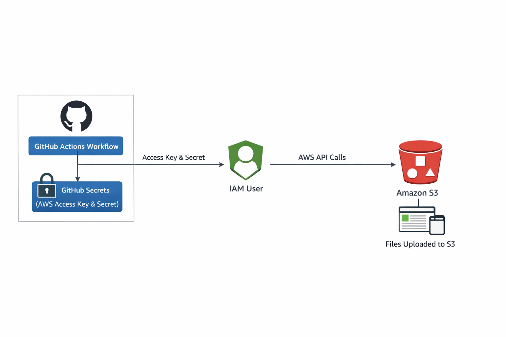
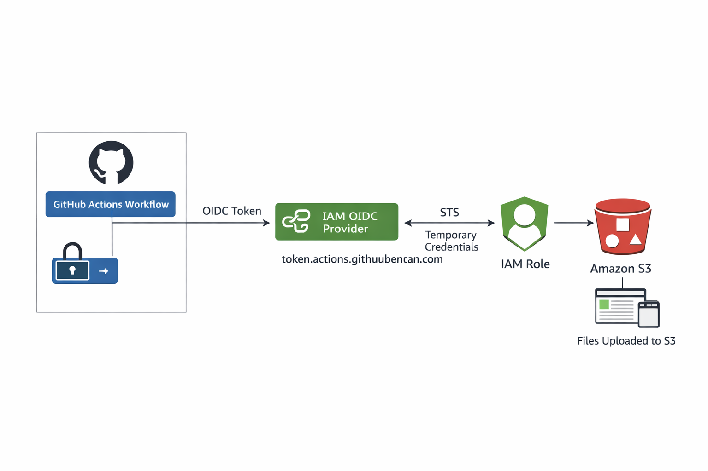

# Replacing Static AWS Keys in GitHub Actions with AWS OIDC

This lab walks through a practical migration: first, a GitHub Actions workflow deploys a small static site to Amazon S3 using long‑lived AWS keys. Then we remove those keys and switch to short‑lived credentials using GitHub OIDC federation and IAM role assumption.

Article:

👉 https://dev.to/iuri_covaliov/replacing-static-aws-credentials-in-cicd-with-github-oidc-a-practical-devops-lab-2222

## What this lab demonstrates

- **Phase 1 — Make it work:** deploy to S3 from GitHub Actions using static AWS credentials (baseline)
- **Phase 2 — Reduce trust / Harden access:** replace static keys with **OIDC → STS → IAM role** (no AWS keys stored in GitHub)
- How to scope the trust policy to a specific **repo** (and optionally **branch**)
- How to validate the credential path with `aws sts get-caller-identity` and CloudTrail
- Optional extension idea: **Docker → ECR → ECS** using the same OIDC pattern

## Architecture overview

### Phase 1 — Make it work
GitHub Actions reads `AWS_ACCESS_KEY_ID` / `AWS_SECRET_ACCESS_KEY` from GitHub Secrets and uploads site files to an S3 bucket.



### Phase 2 — Reduce trust / Harden access
GitHub Actions requests an OIDC token, assumes an IAM role via `sts:AssumeRoleWithWebIdentity`, and receives short‑lived credentials used to upload the same files to S3.



See: `docs/architecture.md`.

## Repository structure

```text
GitHub-AWS-OIDC-Lab/
├── README.md
├── runbook.md
├── docs/
│   ├── architecture.md
│   └── images/
├── examples/
│   ├── site/
│   └── github-workflows/
│       ├── phase1-static-keys.yml
│       └── phase2-oidc.yml
├── provision/                 # optional (terraform/scripts later)
└── diagrams/                  # optional (PlantUML fallback)
```

## How to use this repository

- Start with `runbook.md` and complete **Phase 1** end-to-end.
- Validate the deployment works (S3 contains files; website loads).
- Complete **Phase 2** and remove static keys from GitHub Secrets.
- Validate the same deployment still works (and CloudTrail shows role assumption).

## Scope and non-goals

**In scope**
- IAM user vs IAM role (and why roles are preferable for CI)
- OIDC provider + trust policy for GitHub Actions
- A minimal, reproducible CI/CD deployment to S3

**Out of scope**
- Advanced AWS networking design
- CloudFront, WAF, multi-account setups
- Production-grade observability and governance

## Extensions / next ideas

- Add the optional **ECR + ECS** extension (container build/push/deploy) using the same OIDC role
- Add Terraform to provision the OIDC provider, role, and S3 bucket
- Harden further with environment-based conditions (GitHub Environments) and tighter S3 policies
