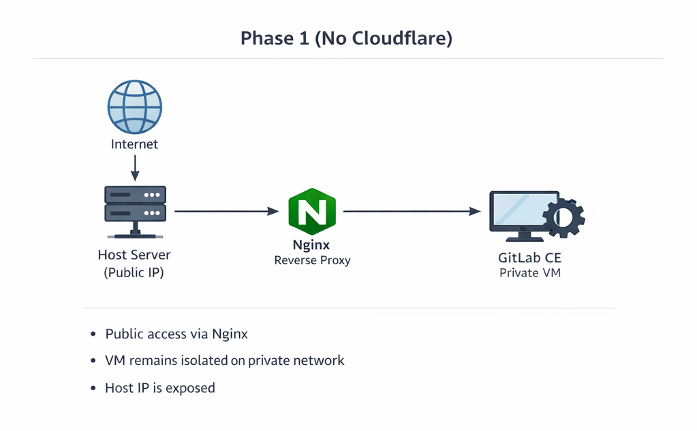
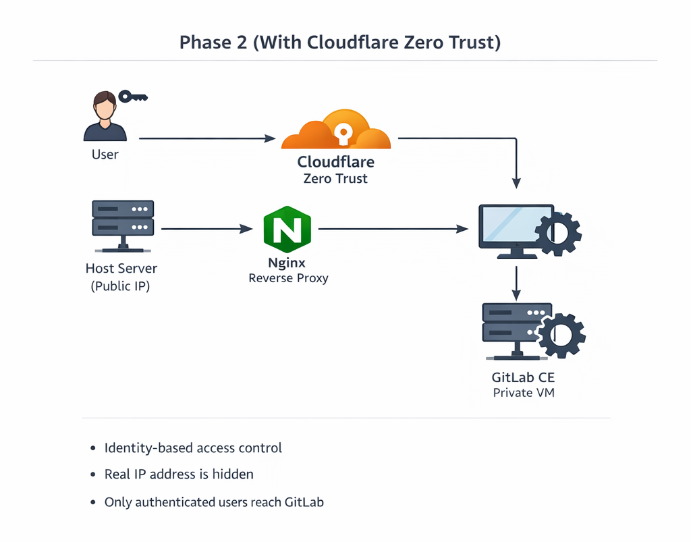

# GitLab CE Behind Cloudflare Zero Trust — Step-by-Step Runbook

This is a **reproducible runbook** for recreating the lab:

- **Phase 1:** GitLab CE in a private VM, exposed via host Nginx, with **direct HTTPS (Let’s Encrypt)**.
- **Phase 2:** Put **Cloudflare Zero Trust (Access)** in front of GitLab.

> Notes:
> - This is a lab guide, not a production hardening guide.
> - Examples use `gitlab.icovaliov.com` and VM IP `192.168.56.101`. Replace with your values.

---

## Contents

- [Prerequisites](#prerequisites)
- [Phase 1 — GitLab behind Nginx + HTTPS](#phase-1--gitlab-behind-nginx--https)
  - [1. Prepare host and VM networking](#1-prepare-host-and-vm-networking)
  - [2. Create VM with Vagrant](#2-create-vm-with-vagrant)
  - [3. Provision / install GitLab CE in the VM](#3-provision--install-gitlab-ce-in-the-vm)
  - [4. Verify GitLab ports (Puma + Workhorse)](#4-verify-gitlab-ports-puma--workhorse)
  - [5. Configure Nginx on the host (proxy to Workhorse)](#5-configure-nginx-on-the-host-proxy-to-workhorse)
  - [6. Configure DNS at registrar](#6-configure-dns-at-registrar)
  - [7. Enable HTTPS with Let’s Encrypt (Certbot)](#7-enable-https-with-lets-encrypt-certbot)
  - [8. First login](#8-first-login)
  - [Troubleshooting Phase 1](#troubleshooting-phase-1)
- [Phase 2 — Cloudflare Zero Trust (Access)](#phase-2--cloudflare-zero-trust-access)
  - [1. Move DNS to Cloudflare](#1-move-dns-to-cloudflare)
  - [2. Cloudflare SSL/TLS settings](#2-cloudflare-ssltls-settings)
  - [3. Create Cloudflare Access application](#3-create-cloudflare-access-application)
  - [4. Add an Identity Provider (GitHub)](#4-add-an-identity-provider-github)
  - [5. Test Access flow](#5-test-access-flow)
  - [6. Make Nginx Cloudflare-aware (client IP)](#6-make-nginx-cloudflare-aware-client-ip)
  - [Troubleshooting Phase 2](#troubleshooting-phase-2)
- [Common gotchas](#common-gotchas)

---

## Prerequisites

### Accounts / services
- A domain with DNS control (initially at a registrar such as GoDaddy).
- A Cloudflare account (Free tier is fine for lab).

### Host (Hetzner)
- Linux host with **public IP**
- Open inbound ports: **80/tcp** and **443/tcp**
- Nginx installed on the host

### VM (GitLab)
- Ubuntu 22.04 recommended
- Minimum: **2 vCPU / 4 GB RAM** (6 GB feels better)
- Disk: **50–80 GB** recommended for comfort

---

# Phase 1 — GitLab behind Nginx + HTTPS



## 1. Prepare host and VM networking

Your goal is:

- VM has a **private IP** (host-only / internal)
- Host can reach VM on:
  - `8181/tcp` (GitLab Workhorse)
  - `8080/tcp` (Puma — internal, mostly for debugging)

Confirm the host can reach the VM IP:

```bash
ping -c 2 192.168.56.101
```

---

## 2. Create VM with Vagrant

In your lab folder, create:

### `Vagrantfile` (example)

```ruby
Vagrant.configure("2") do |config|
  config.vm.box = "ubuntu/jammy64"
  config.vm.hostname = "gitlab-ce"

  # Private network
  config.vm.network "private_network", ip: "192.168.56.101"

  config.vm.provider "virtualbox" do |vb|
    vb.name = "gitlab-ce-lab"
    vb.cpus = 2
    vb.memory = 6144
  end

  # Avoid synced folder for GitLab data
  config.vm.synced_folder ".", "/vagrant", disabled: true
  config.vm.synced_folder "./provision", "/opt/provision", create: true

  config.vm.provision "shell", path: "provision/install_gitlab.sh", privileged: true
end
```

Bring it up:

```bash
vagrant up
```

Re-run provisioning later with:

```bash
vagrant provision
```

---

## 3. Provision / install GitLab CE in the VM

### Key idea
- Set `external_url` to the **final hostname** early (even before Cloudflare).
- Disable GitLab’s bundled Nginx (because the host Nginx is the reverse proxy).
- Proxy to **Workhorse** on `8181` (not Puma on `8080`).

### Recommended GitLab `gitlab.rb` settings

In `/etc/gitlab/gitlab.rb`:

```ruby
external_url "https://gitlab.icovaliov.com"

nginx['enable'] = false

# Puma (Rails)
puma['listen'] = '0.0.0.0'
puma['port'] = 8080

# Workhorse (fronts Puma; recommended upstream for external Nginx)
gitlab_workhorse['listen_network'] = "tcp"
gitlab_workhorse['listen_addr'] = "0.0.0.0:8181"

# Optional backups path
gitlab_rails['backup_path'] = "/srv/gitlab-backups"
```

Apply:

```bash
sudo gitlab-ctl reconfigure
```

> If you use a provisioning script, ensure it writes the above settings and runs `gitlab-ctl reconfigure`.

---

## 4. Verify GitLab ports (Puma + Workhorse)

Inside the VM:

```bash
sudo gitlab-ctl status
sudo ss -lntp | grep -E ':(8080|8181)\s'
```

Expected:
- `0.0.0.0:8080` (puma)
- `0.0.0.0:8181` (gitlab-workhorse)

Verify locally:

```bash
curl -I http://127.0.0.1:8181/users/sign_in
```

---

## 5. Configure Nginx on the host (proxy to Workhorse)

Install Nginx on the host if needed:

```bash
sudo apt update
sudo apt install -y nginx
```

Create `/etc/nginx/sites-available/gitlab.conf`:

```nginx
upstream gitlab_vm {
  server 192.168.56.101:8181;
  keepalive 32;
}

server {
  listen 80;
  server_name gitlab.icovaliov.com;

  client_max_body_size 0;

  location / {
    proxy_pass http://gitlab_vm;

    proxy_http_version 1.1;
    proxy_set_header Host              $host;
    proxy_set_header X-Real-IP         $remote_addr;
    proxy_set_header X-Forwarded-For   $proxy_add_x_forwarded_for;
    proxy_set_header X-Forwarded-Proto $scheme;

    proxy_read_timeout  3600;
    proxy_connect_timeout 300;
    proxy_redirect off;
  }
}
```

Enable + reload:

```bash
sudo ln -sf /etc/nginx/sites-available/gitlab.conf /etc/nginx/sites-enabled/gitlab.conf
sudo nginx -t
sudo systemctl reload nginx
```

Test locally (before DNS) using Host header:

```bash
curl -I -H "Host: gitlab.icovaliov.com" http://127.0.0.1/users/sign_in
```

---

## 6. Configure DNS at registrar

At your registrar, create:

- `A` record: `gitlab.icovaliov.com` → `<host public IP>`

Verify from your laptop:

```bash
dig gitlab.icovaliov.com +short
```

---

## 7. Enable HTTPS with Let’s Encrypt (Certbot)

On the **host**:

```bash
sudo apt update
sudo apt install -y certbot python3-certbot-nginx
```

Request a cert:

```bash
sudo certbot --nginx -d gitlab.icovaliov.com
```

Choose:
- Redirect HTTP → HTTPS (recommended)

Verify:

```bash
curl -I https://gitlab.icovaliov.com/users/sign_in
```

Test renewal:

```bash
sudo certbot renew --dry-run
sudo systemctl list-timers | grep certbot || true
```

---

## 8. First login

### Initial root password
Inside the VM:

```bash
sudo cat /etc/gitlab/initial_root_password
```

Then open:

- `https://gitlab.icovaliov.com`

Login:
- user: `root`
- password: from `initial_root_password`

> If you see `422: The change you requested was rejected`, you are almost certainly accessing **HTTP** while `external_url` is **HTTPS**. Fix by using HTTPS (or aligning `external_url`).

---

## Troubleshooting Phase 1

### UI loads but looks like “unstyled HTML”
Make sure the host Nginx upstream points to **Workhorse (8181)**, not Puma (8080). GitLab is typically served correctly via Workhorse when using an external reverse proxy.

### 502 Bad Gateway from Nginx
On the host:

```bash
sudo tail -n 50 /var/log/nginx/error.log
```

Common causes:
- Wrong VM IP
- Wrong port (8181 vs 8081 typo)
- Workhorse not listening on 0.0.0.0:8181

Validate upstream from host:

```bash
curl -I http://192.168.56.101:8181/users/sign_in
```

---

# Phase 2 — Cloudflare Zero Trust (Access)



## 1. Move DNS to Cloudflare

In Cloudflare:
- Add your domain
- Choose Free plan
- Cloudflare provides nameservers

At your registrar:
- Replace nameservers with Cloudflare nameservers

In Cloudflare DNS:
- Ensure `gitlab.icovaliov.com` record exists
- Proxy status: **Proxied (orange cloud)**

---

## 2. Cloudflare SSL/TLS settings

In Cloudflare → SSL/TLS:
- Set encryption mode: **Full (strict)**

This works well because your origin already has a valid Let’s Encrypt certificate.

---

## 3. Create Cloudflare Access application

Cloudflare Zero Trust dashboard:
- **Access → Applications → Add application**
- Choose **Self-hosted**
- Domain: `gitlab.icovaliov.com`

Create an **Allow** policy (start strict: only you).

---

## 4. Add an Identity Provider (GitHub)

UI note: In the current dashboard this is under:

- **Integrations → Identity providers**

Add **GitHub** and authorize.

Then in your GitLab Access policy:
- Include: GitHub (your user)

> If you try “email OTP” and don’t receive codes, switching to a real IdP (GitHub/Google) is typically more reliable for labs.

---

## 5. Test Access flow

Open an incognito window:

- `https://gitlab.icovaliov.com`

Expected:
- Cloudflare Access login prompt
- After authenticating, GitLab loads normally

---

## 6. Make Nginx Cloudflare-aware (client IP)

If you want real client IPs in logs, in the host Nginx **443** server block:

```nginx
real_ip_header CF-Connecting-IP;
```

Reload:

```bash
sudo nginx -t
sudo systemctl reload nginx
```

(Optional, more secure later):
- Restrict origin firewall to Cloudflare IP ranges only.

---

## Troubleshooting Phase 2

### Access login works but Git operations fail
Git over HTTPS behind Access may require:
- GitLab Personal Access Tokens (PAT), or
- more advanced Cloudflare Access service token patterns.

Start with PATs for a lab.

### Can reach origin directly (bypassing Access)
That means the origin is still reachable by its public IP. To prevent bypass:
- firewall restrict 80/443 to Cloudflare IP ranges, or
- use Cloudflare Tunnel.

---

## Common gotchas

### 1) 422 on login
Cause: `external_url` is `https://...` but you access `http://...` (Secure cookies aren’t sent over HTTP). Fix: use HTTPS and keep `external_url` aligned.

### 2) Wrong upstream port
Workhorse is commonly `8181`. A typo like `8081` will cause 502 from Nginx.

### 3) Unstyled GitLab UI
Proxy to Workhorse (`8181`) rather than Puma (`8080`) when using an external reverse proxy.

### 4) VM disk space
GitLab grows. Prefer 50–80 GB for labs so you don’t hit disk pressure during experiments.

---

## Appendix: Useful commands

### GitLab service control (VM)

```bash
sudo gitlab-ctl status
sudo gitlab-ctl restart
sudo gitlab-ctl tail
sudo gitlab-ctl reconfigure
```

### Nginx checks (host)

```bash
sudo nginx -t
sudo systemctl reload nginx
sudo tail -n 100 /var/log/nginx/error.log
```
