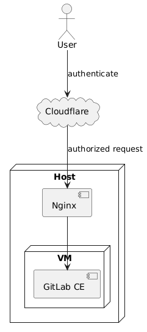
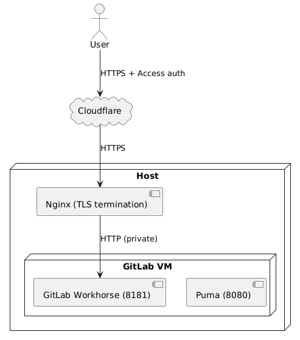
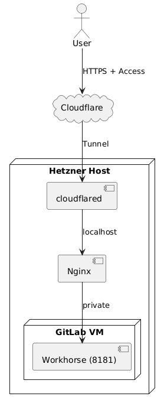

# GitLab SE behind Cloudflare Zero Trust

DevOps Lab

## Goal

The goal of this project is to build a **self-hosted GitLab Community Edition (CE)** instance in a controlled lab environment and progressively secure it using **Cloudflare Zero Trust**, relying only on free tiers and minimal infrastructure.

This setup is not intended for production traffic, but rather for:
- learning DevOps fundamentals
- understanding reverse proxies
- experimenting with Zero Trust concepts
- practicing phased infrastructure evolution

The lab is designed so that each phase is usable on its own, while still serving as a foundation for the next phase.

---

## The Initial Idea

Instead of exposing GitLab directly to the internet, the system is built in layers:

1. GitLab lives in a private VM
2. A reverse proxy handles public traffic
3. Cloudflare eventually becomes the gatekeeper

Each layer adds responsibility — and reduces risk.

---

## Overview

The project is implemented in two phases:
- **Phase 1**: Public access via Nginx reverse proxy
- **Phase 2**: Identity-protected access via Cloudflare Zero Trust

At all times:
- GitLab runs inside a ***virtual machine***
- Only the ***host server*** has a public IP
- The VM remains on a ***private network***

---

## Key Technologies

- **GitLab CE**
- **Cloudflare** (Free tier + Zero Trust)
- Nginx
- VirtualBox + Vagrant
- dedicated server / VM host (in my case it's a dedicated server on Hetzner)
- DNS (later delegated to Cloudflare) (I used GoDaddy)

---

## How It Is Supposed to Work

### Phase 1 (No Cloudflare)

```
Internet
  ↓
Host (Public IP)
  └─ Nginx (Reverse Proxy)
        ↓
      GitLab CE (VM, Private IP)
```

- GitLab is not directly exposed
- Nginx handles incoming HTTP traffic
- DNS points directly to the Host

---

### Phase 2 (With Cloudflare Zero Trust)



- Cloudflare becomes the entry point
- Access is restricted by identity (SSO, email, etc.)
- The real server IP is hidden
- GitLab only serves authenticated users

---

### Realization Plan

- Prepare virtualization and networking
- Install GitLab CE inside a private VM
- Expose GitLab via Nginx on the host
- Configure DNS for public access
- Migrate DNS to Cloudflare
- Enable Cloudflare proxying
- Apply Zero Trust access rules
- Each step is reversible and testable.

---

## Phase 1: GitLab CE Behind Nginx

**Goal** is simple: *make GitLab reachable*.

---

### 1. Prepare the VM

- OS: Ubuntu 22.04
- RAM: 4 GB minimum
- CPU: 2 cores
- Disk: 30+ GB
- Network: private only (e.g. `192.168.56.0/24`)

Example Vagrant network configuration:

```ruby
config.vm.network "private_network", ip: "192.168.56.10", adapter: 2
```

Checkout [full Vagrantfile](./Vagrantfile)

---

### 2. Install GitLab SE

You may prepare the system and install GitLab SE by yourself or use [the provision script](./provision/install_gitlab.sh) that included into the Vagrantfile.

>Important note
>- external_url should already be the final hostname
> Even in Phase 1, set it to https://gitlab.yourdomain.com so you don’t have to change it later when Cloudflare is added.
> To configure it in the provision script set the GITLAB_FQDN variable using your real domain name for your GitLab instance.

---

#### Quick verification step

After provisioning (or manually), check:
```
sudo grep -E "nginx\['enable'\]|puma\['port'\]|gitlab_rails\['backup_path'\]" /etc/gitlab/gitlab.rb
```

You should see:
```
nginx['enable'] = false
puma['port'] = 8080
gitlab_rails['backup_path'] = "/srv/gitlab-backups"
```

```
sudo ss -lntp | grep -E ':(8080|8181)\s'
```

Expected:
- 0.0.0.0:8080 (puma)
- 0.0.0.0:8181 (workhorse)

---

#### Print the initial GitLab password location

On first install, GitLab Omnibus writes it to a file. Add this near the end of the script:
```
if [ -f /etc/gitlab/initial_root_password ]; then
  echo "[*] Initial root password file: /etc/gitlab/initial_root_password"
  echo "[*] (This file may be removed automatically after 24h.)"
fi
```
If the file exists run
```
cat /etc/gitlab/initial_root_password
```
copy and save initial root password, should be smth like this:
```
Password: nECQbmtKQgOTgdXgFzAfLJPFM+2gJ1CZDOpKUWpOiuU=
```

---

### 3. Configure Nginx on Host

#### 1. Install Nginx on the Host if you don't have.

On the host:
```
apt update
apt install -y nginx
```

---

#### 2. Create configuration file for GitLab:

```
sudo nano /etc/nginx/sites-available/gitlab.conf
```

Minimal reverse-proxy configuration:
```nginx
server {
    listen 80;
    server_name gitlab.example.com;

    location / {
        proxy_pass http://192.168.56.10:8181;
        proxy_set_header Host $host;
        proxy_set_header X-Forwarded-Proto $scheme;
        proxy_set_header X-Forwarded-For $remote_addr;
    }
}
```
More extended:
```
upstream gitlab_vm {
  server 192.168.56.10:8181;
  keepalive 32;
}

server {
  listen 80;
  server_name gitlab.example.com;

  # Increase limits for Git pushes and large requests
  client_max_body_size 0;

  location / {
    proxy_pass http://gitlab_vm;

    proxy_http_version 1.1;
    proxy_set_header Host              $host;
    proxy_set_header X-Real-IP         $remote_addr;
    proxy_set_header X-Forwarded-For   $proxy_add_x_forwarded_for;
    proxy_set_header X-Forwarded-Proto $scheme;

    proxy_read_timeout  3600;
    proxy_connect_timeout 300;
    proxy_redirect off;
  }
}
```

---

#### 3. Enable it:

```
sudo ln -s /etc/nginx/sites-available/gitlab.conf /etc/nginx/sites-enabled/gitlab.conf
sudo nginx -t
sudo systemctl reload nginx
```

---

#### 4. Test before touching DNS

From anywhere that can resolve the hostname, you can test by overriding DNS locally on the host:
```
curl -I -H "Host: gitlab.yourdomain.com" http://127.0.0.1/
```
You should get 200 OK (or 302) and GitLab-ish headers.

Also test directly:
```
curl -I http://<your_host_public_ip>/
```
This will only work correctly after DNS points to it or if you set server_name _; temporarily. Better to test using the Host header as shown.

---

### 4. Configure DNS

For me it's at GoDaddy.

Create 'A' record:
```
gitlab → <Your Host public IP>
```

Once DNS propagates, you should be able to open the login page of your GitLab instance:
```
http://gitlab.yourdomain.com
```

---

### 5. Configure HTTPS access

#### 1. Obtain the Let’s Encrypt certificate

Install and run on the Host:
```
sudo apt update
sudo apt install -y certbot python3-certbot-nginx

certbot --version

sudo certbot --nginx -d gitlab.yourdomain.com
```

Certbot will ask:
- email → enter yours
- terms → agree
- redirect HTTP → HTTPS → YES

Certbot will:
- Validate ownership
- issue the cert
- modify Nginx config automatically
- enable HTTPS
- add HTTP → HTTPS redirect

---

#### 2. Verify the final Nginx config

Open the config:
```
sudo nano /etc/nginx/sites-enabled/gitlab.conf
```

You should now see:
- a server { listen 443 ssl; } block
- SSL paths like:
```
/etc/letsencrypt/live/gitlab.yourdomain.com/fullchain.pem
/etc/letsencrypt/live/gitlab.yourdomain.com/privkey.pem
```

Inside the 443 server block, confirm you have one of these:
```
proxy_set_header X-Forwarded-Proto https;
```
or
```
proxy_set_header X-Forwarded-Proto $scheme;
```

Reload Nginx:
```
sudo nginx -t
sudo systemctl reload nginx
```

---

#### 3. Test HTTPS

From your laptop:
```
curl -I https://gitlab.yourdomain.com/users/sign_in

```

Expected:
- valid certificate
- no browser warning
- HTTP 200 or 302

---

#### 4. Log in to GitLab

Open in browser:
```
https://gitlab.yourdomain.com
```

Log in as:
- username: root
- password: from VM:
```
sudo cat /etc/gitlab/initial_root_password
```

By now your GitLab instance should be fully available through HTTPS requests.

---

#### 5. Verify auto-renewal

On the host:
```
sudo systemctl list-timers | grep certbot || true
sudo certbot renew --dry-run
```

You want:
- a systemd timer
- dry-run success

---

## Phase 2: Cloudflare Zero Trust

### Architecture



---

### Add Domain to Cloudflare and switch DNS

Cloudflare
- Create a free Cloudflare account
- Add your domain
  Domains -> Domain Management -> Onboard a domain
  Enter an existing domain Or register a new domain:  yourdomain.com
  -> Continue -> Free -> Select plan ->
  In the list of DNS records select:                  A/gitlab/Host IP/...
  -> Continue to activation
  Next you'll see instractions for updating your domain configuration at your DNS provider (like GoDaddy).
DNS provider
- Update nameservers at registrar
  - remove old nameservers
  - add nameservers given by Cloudflare
- Make sure DNSSEC is off
Cloudflare
-> I updated my nameservers

---

### Keep SSL correct: Full (strict)

In Cloudflare -> SSL/TLS -> Configure -> Set encryption mode to Full (strict).
-> Save

Because you already have a Let’s Encrypt cert on your host Nginx, Full (strict) will work cleanly.

---

### Turn on Cloudflare Access (Zero Trust) for GitLab

Cloudflare Zero Trust includes “Access” and has a free plan suitable for small teams / proofs of concept.

---

#### Create the protected app

In Cloudflare One / Zero Trust:
- Select Free plan if you're there
- Access → Applications → Add application
- Choose Self-hosted
- Domain: gitlab.yourdomain.com
  (Cloudflare’s docs show this flow for self-hosted public apps.)

---

#### Add an Access policy

Start simple:
- Allow → your email (or your email domain)
- Optional: require MFA at IdP

Result:
- Unauthenticated users never reach GitLab
- You get an “Access login” page in front of GitLab

---

#### Make Nginx “Cloudflare-aware” (recommended)

This is not strictly required to function, but it’s the right hardening step.

---

##### A) Restore real client IP (Cloudflare → Nginx)

In your Nginx server block (443), add:
```
# Trust Cloudflare to pass real client IP
real_ip_header CF-Connecting-IP;

# (Optional) trust only Cloudflare IP ranges — you can add them later.
# set_real_ip_from <cloudflare-ip-range>;
```

Restart Nginx service:
```
sudo nginx -t
sudo systemctl reload nginx
```

---

##### B) Lock down direct-to-origin access (optional but ideal)

Once Cloudflare is in front, you can:
- firewall port 443 to only allow Cloudflare IP ranges, or
- at minimum require the Access layer so random scanners can’t hit the origin directly

You could try it by yourself, it's not a scope of this lab.

---

#### Validate Phase 2

Checks
1. Opening https://gitlab.yourdomain.com shows Cloudflare Access login (not GitLab directly).
2. After authenticating, GitLab loads fully (CSS/JS ok).
3. Cloning/pushing via HTTPS still works after Access (may require PAT/token).

---

### Optional: go “no inbound ports” with Cloudflare Tunnel

This is the “extra credit” step after Access works you could try.

Cloudflare Tunnel uses cloudflared to create outbound-only connections, so your origin does not need a publicly reachable IP/port.

That would change your architecture to:



Not necessary right now, but a great next lab milestone.

---