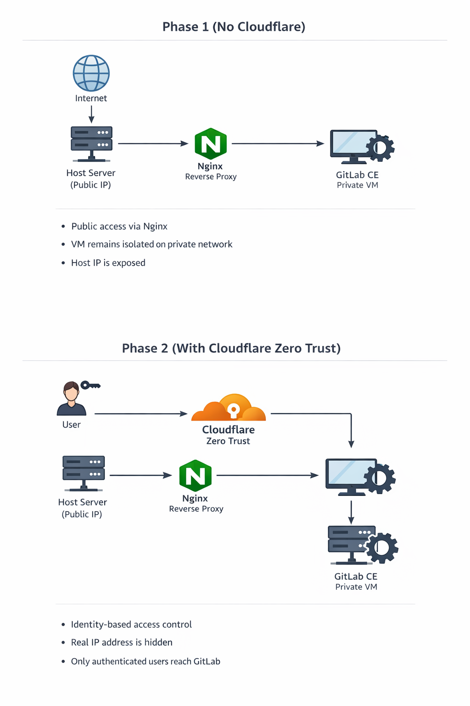

# GitLab CE Behind Cloudflare Zero Trust — DevOps Lab

This repository contains a hands-on DevOps lab that explores how to **self-host GitLab Community Edition securely** by layering access and gradually reducing implicit trust.

The lab is intentionally built in phases: starting from a working but minimal setup, and evolving toward an identity-aware, Zero Trust–style architecture.

---

## 📖 Related article

The full architectural rationale, design decisions, and lessons learned are documented in the accompanying article:

👉 https://dev.to/iuri_covaliov/self-hosting-gitlab-behind-cloudflare-zero-trust-a-practical-devops-lab-18ce

The article explains **why** each layer exists.
This repository shows **how** the lab is implemented.

---

## What this lab demonstrates

- Running GitLab CE on a private virtual machine
- Exposing GitLab safely using a reverse proxy
- Proper HTTPS handling
- Identity-based access using Cloudflare Zero Trust
- Incremental security instead of "all-at-once" hardening

The focus is on **architecture and decision-making**, not on producing a production-ready GitLab deployment.

---

## Architecture overview

The lab evolves through two main phases:

### Phase 1 — Make it work
- GitLab runs inside a private VM
- The host machine acts as a reverse proxy
- GitLab is reachable via HTTPS

### Phase 2 — Stop trusting the network
- Cloudflare sits in front of the origin
- Access is enforced at the identity layer
- Unauthenticated traffic never reaches GitLab

Diagrams for both phases are available in the `docs/` directory.



---

## Repository structure

```
GitLabSE-behind-CloudFlare/
├── Vagrantfile            # VM definition for GitLab CE
├── provision/             # Provisioning scripts (OS + GitLab setup)
├── docs/                  # Diagrams and supporting documentation
└── readme.md              # This file
```

---

## How to use this repository

This lab is intended for **experimentation and learning**.

It assumes familiarity with:
- Linux administration
- Vagrant and VirtualBox
- Basic networking and HTTP concepts

High-level flow:
- GitLab runs inside the VM
- Nginx runs on the host and proxies traffic
- Cloudflare is added later as an external access layer

For detailed steps and explanations, refer to the article linked above.

---

## Scope and non-goals

This repository is **not** intended to be:
- a production blueprint
- a hardened security reference
- a drop-in GitLab deployment guide

Instead, it focuses on:
- understanding layered access
- applying Zero Trust principles pragmatically
- learning through controlled experimentation

---

## Where to go next

Possible extensions of this lab include:
- Cloudflare Tunnel (no inbound ports)
- GitLab Runners
- Infrastructure as Code refactoring
- Migration to a different virtualization stack

---

## License

This project is provided for educational purposes.

