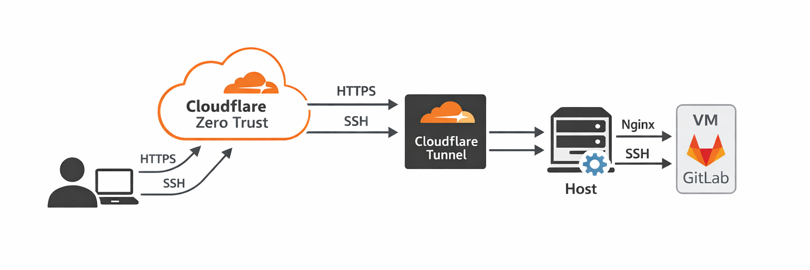

# GitLab SE behind Cloudflare Zero Trust: Part 2. Introducing the Tunnels

This lab extends the previous [GitLab Zero Trust setup](../GitLabSE-behind-CloudFlare/readme.md) by removing direct
inbound SSH exposure and shifting to an outbound-only connectivity model
using Cloudflare Tunnel.

Instead of relying on open ports, both HTTPS and SSH access are gated by
identity and routed through Cloudflare. The GitLab VM remains private
and disposable, while the host establishes secure outbound connections.

📖 Full article:\
(link to be added)

📖 Previous article:\
https://dev.to/iuri_covaliov/self-hosting-gitlab-behind-cloudflare-zero-trust-a-practical-devops-lab-18ce

------------------------------------------------------------------------

## What This Lab Demonstrates

-   Outbound-only service exposure using Cloudflare Tunnel
-   Identity-enforced SSH access to GitLab
-   Separation of HTTP and SSH ingress paths
-   Disposable VM design with predictable recovery steps
-   Operational considerations (SSH host key rotation, tunnel
    persistence)

------------------------------------------------------------------------

## Architecture Overview

### Phase 1 --- Reverse Proxy + Access

User\
→ Cloudflare (DNS + Access)\
→ Host Nginx (public 443)\
→ VM (GitLab)

SSH:\
User → Host public 22 → VM 22

Network exposure still exists.

------------------------------------------------------------------------

### Phase 2 --- Tunnel + Identity-Gated SSH

User\
→ Cloudflare Access\
→ Cloudflare Tunnel (outbound from host)\
→ Nginx (HTTP)\
→ VM (GitLab)

SSH:\
User → Cloudflare Access\
→ Cloudflare Tunnel\
→ VM (SSH)

No direct inbound SSH required.

Identity becomes the primary trust boundary.

------------------------------------------------------------------------

## Repository Structure

    GitLabSE-behind-CloudFlare/
    ├── README.md
    ├── runbook.md
    └── docs/
        └── images/

------------------------------------------------------------------------

## How to Use This Repository

1.  Ensure Lab 1 (GitLab + Nginx + Access) is working.
2.  Follow [`runbook.md`](runbook.md) step by step.
3.  Validate:
    -   HTTPS access through Cloudflare
    -   SSH access via Cloudflare Tunnel
    -   Git clone over SSH
4.  Reboot the host to confirm tunnel persistence.
5.  Recreate the VM to validate disposable infrastructure behavior.

------------------------------------------------------------------------

## Scope and Non-Goals

This lab:

-   Does not require firewall reconfiguration.
-   Does not enforce inbound port closure (though the architecture
    supports it).
-   Focuses on exposure model and identity boundary, not cloud provider
    specifics.

------------------------------------------------------------------------

## Design Decisions

-   Host Nginx remains unchanged.
-   Tunnel runs as a systemd service.
-   SSH uses a dedicated hostname (`ssh-<domain>`).
-   Access policies may differ between HTTP and SSH.
-   VM is treated as disposable infrastructure.

------------------------------------------------------------------------

## Possible Extension --- Private GitLab Runners

A natural next step is adding one or more GitLab Runner VMs inside the
same private network.

The runner VM would:

-   Be reachable only from the host or internal network
-   Register with GitLab via the internal address
-   Execute CI jobs without any public exposure

This would extend the model from secure access to secure execution.

------------------------------------------------------------------------

## Published Labs in This Series

-   [Securing a Remote Linux Host with firewalld and OpenVPN](../ProtectRemoteHostWithFirewallAndVPN/readme.md)
-   [GitLab Behind Cloudflare Zero Trust](../GitLabSE-behind-CloudFlare/readme.md)

------------------------------------------------------------------------

Each lab in this series explores a specific infrastructure boundary and
gradually shifts trust from network-level controls to identity and
workload isolation.
